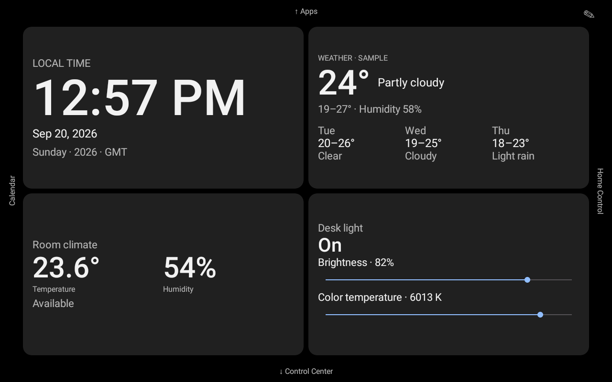
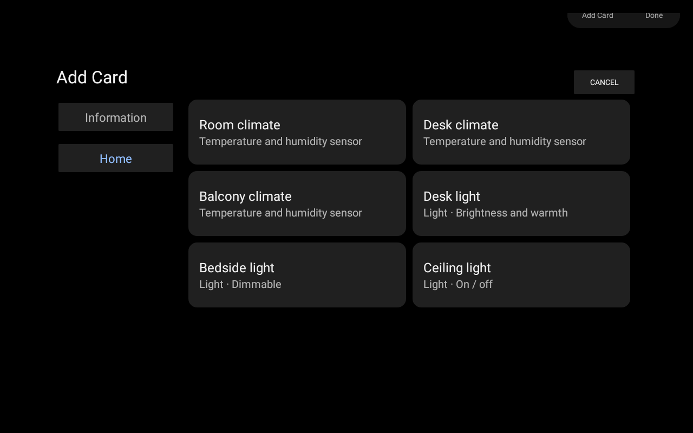

# PR 3 — Core Cards & Appearance

This amendment stays on `feat/core-cards-appearance`. It retains Kotlin/Android Views, the
8×6 grid, Room layout persistence, Android 9 support, and the existing application version.
There is no Home Assistant networking, authentication, or system-service integration.

## Responsive cards

`ClockCardView`, `WeatherCardView`, `SensorCardView`, and `LightCardView` each own their view
hierarchy and rendering. `DashboardCardView` shares only binding, appearance, and interaction
mechanics; `SourceCardView` shares subscription cleanup and a render-change key. There is no
`CoreCardKind` renderer or global compact/standard/expanded switch. A new provider can supply
its own view and size presentation without changing another card or the grid engine.

The pure `clockPresentation`, `weatherPresentation`, `sensorPresentation`, and
`lightPresentation` functions derive different layouts from both width and height. All four
providers now accept the 2×1–4×3 range, a superset of previously supported sizes.

- Clock: compact time only; taller cards add the local date; a wide large card uses a 104sp
  target time with text-fit bounds and local weekday/year/timezone details. Device locale and
  12/24-hour settings remain authoritative. Minute-boundary updates and hidden/detached
  callback/broadcast cleanup are preserved.
- Weather: a temperature/condition row in compact cards, a stacked current-weather layout
  in narrow medium cards, and forecast columns in large cards. Forecast data is a list of
  timestamped `WeatherForecast` values (condition, low, high), not preformatted multiline text.
- Sensor: compact paired values, stacked value/label rows at 2×2, and large side-by-side
  readings on wider cards. Stale/unavailable state remains explicit.
- Light: name/state at 2×1, dominant brightness at 2×2 where supported, inline brightness at
  3×2, and brightness plus color temperature at 3×3/4×3 where supported. Long press on card
  content opens complete quick controls. A slider owns touches beginning on the slider.

`DashboardTypography` defines a shared hierarchy: minor labels 16sp, normal secondary
information 22sp, titles 24sp, dominant values 40–72sp, and a 104sp large-clock target.
Per-card presentation functions select appropriate sizes within that hierarchy. PR 3 UI
labels and formatted values use Android string resources; fake device names/conditions
remain data supplied by the source.

## Catalog and Add Card

`CardCatalog` is an observable discovery interface. `SourceCardCatalog` projects the current
`DashboardDataSource` into `CardAddCandidate` values with category, stable candidate ID,
provider type, display name, description, and creation configuration. It publishes catalog
changes only when candidate metadata changes, not for every light brightness update.

Information contains static Clock and Weather candidates. Home contains all current source
sensors and lights, including individual Room/Desk/Balcony climate and Desk/Bedside/Ceiling
light candidates. Empty future categories are not shown. No entity list is duplicated in
views or hard-coded in the picker.

`CardPickerDialog` is a custom landscape layout with category navigation and large candidate
tiles. It observes both catalog and appearance while open. `DashboardStateHolder.add(candidate)`
uses the selected candidate's configuration and a new UUID. Repeated instances of one device
are allowed. There is no provider-only Add Light operation that defaults every selection to desk.

The page dismisses the picker on detach. The picker and quick controls retain the panel's
immersive window presentation. The normal dashboard has small edge labels in reserved gutters
and a subtle pencil with a 48dp touch target. Empty-space long press and explicit Edit remain
available; navigation labels do not overlay the grid.

## State, gestures, and appearance

`DashboardViewModel` retains one device source and one `AppearanceController`. Cards subscribe
on attach and unsubscribe on detach. Fake commands publish immutable state; views do not keep
an optimistic device-state copy. Source-driven updates rebind affected card contents, not the
whole dashboard. Catalog candidates are derived projections, not another device-state owner.

Inline controls use `ClaimingSeekBar` plus `CardInteractionScope.claimFromDown`. The existing
page arbitration checks the ownership tag before observing a swipe. Sliders retain 48dp touch
targets. Edit mode disables provider listeners and inline controls, and still blocks page
swipes while the existing chrome handles drag, resize, add, and delete.

Appearance remains a separate locally persisted observable controller. Dark page background
is #000000; transparent dark card surfaces blend into pure black. Opacity affects fill only.
Existing views, the picker, and quick controls update without Activity recreation. No global
appearance fields are written into per-card configuration.

## PR 4 contracts

Preserve stable provider keys `clock`, `weather`, `sensor`, `light` and the existing opaque
`sensorId`/`lightId` configuration fields. Existing valid layouts and empty dashboards are not
reseeded. Missing fields in legacy cards keep their former default interpretation; newly added
instances always receive catalog configuration. Removed mock providers continue through the
existing pre-release repair path.

A real backend can replace `DashboardDataSource` and either retain the generic source-derived
catalog or supply another `CardCatalog`. Keep callbacks on the main thread, emit the current
snapshot on subscription, retain availability/capability semantics, and route device commands
through the source. Brightness is percent; color temperature is Kelvin in an advertised range.
Use stable source IDs independent of display names. UI classes must not learn HA protocols.
Optional future helper synchronization must go through the same `AppearanceController`.

## Verification and visual evidence

Environment: X08E AVD, API 28, 1280×800, 160dpi, 2048 MB RAM. Physical Xiaomi hardware and
long-duration memory/CPU soak tests have not been performed.

Executed on 2026-09-20:

```text
gradlew.bat assembleDebug testDebugUnitTest lintDebug connectedDebugAndroidTest
```

42 JVM tests and all 10 instrumentation tests passed. Debug assembly passed. Final lint reports
no issues. Tests cover per-provider size decisions, candidate identity/configuration and source
discovery updates, duplicate instance creation, configuration persistence, layout repair,
brightness/Kelvin bounds, appearance restore/notification, and existing grid/navigation logic.
The device suite covers real drag resize for all four providers, minute rollover, all four
navigation routes, long press, inline/dialog slider gestures, edit isolation, selected device
creation, readable sensor labels, live theme changes, and fill-only opacity.

Manual force-stop/relaunch verification additionally confirmed that Light + 46% appearance
restored in both the preferences file and the Control Center UI. Dark 0% and 100% fill were
rechecked, then the emulator's prior Dark + 100% appearance was restored.

The screenshot scenario was also run directly with `reviewScreenshots=true`. It uses actual
emulator screen captures while performing the candidate selections and inline gestures.
Representative size changes go through the normal state holder/engine. UI tests save and
restore the emulator's prior layout/appearance around each test instead of assuming the
user's dashboard contains unique device instances.

The following captures were visually inspected; they are repository review artifacts, not mockups:

| Capture | Sizes / scenario |
| --- | --- |
| [Seed dashboard](pr3-review/01-seed-dark.png) | Clock/Weather 4×3; Sensor and three Light variants 2×2 |
| [Information picker](pr3-review/02-picker-information-dark.png) | Static candidates, dark theme |
| [Home picker](pr3-review/03-picker-home-dark.png) | Six concrete source candidates, dark theme |
| [Distinct instances](pr3-review/04-distinct-instances.png) | Bedside + Ceiling lights; Room + Desk sensors, all 2×2 |
| [Large dark](pr3-review/05-large-dark.png) | Clock, Weather, Sensor, Light all 4×3; both inline sliders |
| [Large light](pr3-review/06-large-light.png) | Same four 4×3 cards, light theme |
| [Light picker](pr3-review/07-picker-home-light.png) | Theme-aware Home candidates |
| [Quick controls](pr3-review/08-light-dialog.png) | Long press still opens the full dialog |
| [Compact](pr3-review/09-compact-dark.png) | Clock, Weather, Sensor, Light all 2×1 |
| [Wide controls](pr3-review/10-wide-sensor-and-light.png) | Sensor 3×2; Light 3×2 with brightness only |
| [Tall controls](pr3-review/11-light-3x3.png) | Light 3×3 with brightness and color temperature |




